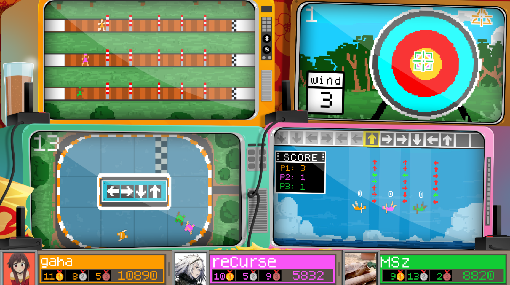
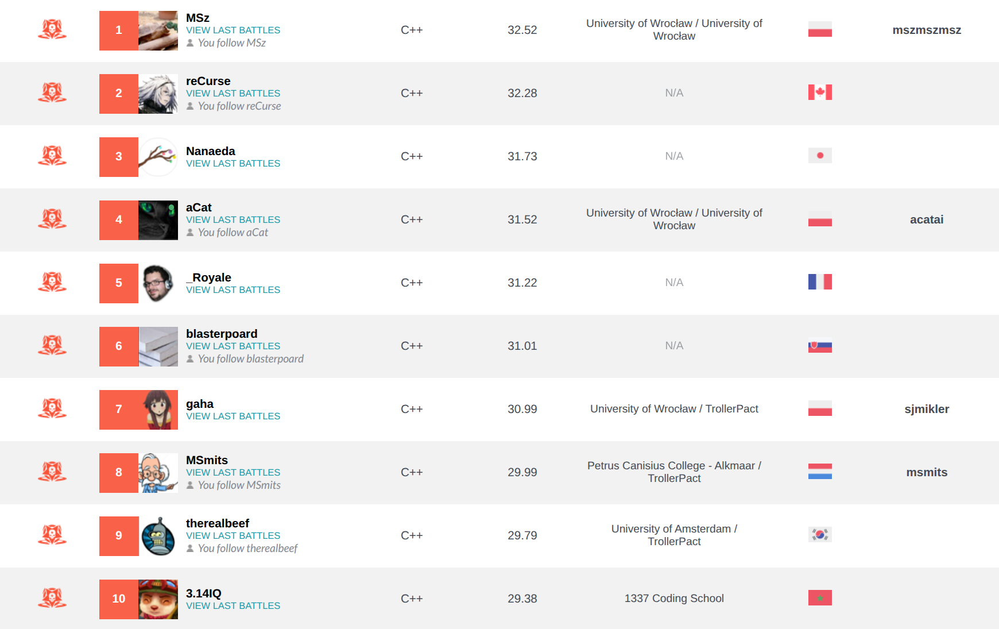

# Olymbits

[CodinGame Leaderboard Link](https://www.codingame.com/contests/summer-challenge-2024-olymbits/leaderboard/global)

Final Position: **#7** 

## Approach

I am using Smitsimax - so 3xMCTS; one per player. I do rollouts up to depth 30, replacing minigames as they finish. I keep a pool of random minigames generated in turn 0, so I can load them up quickly. If I am finishing the search before turn 100, I add a small amount of bonus points to all minigames, which represent the expected points players will get in the future minigames. I decay this bonus linearly as the game progresses.

I have a heuristic to rate all 4 moves given the game state: I am using an array of size 3 in which the 3 minigames (hurdles, diving, archery) are voting for moves by adding a heuristically chosen amount of points to each move (U, L, D, R). For example, in some imaginary game state, hurdle minigame might be voting [0, 4, 4, 10], diving [0, 8, 0, 0] and archery [4, 5, -4, -5]; skating is ignored in this heuristic. Votes are then summed up to: [4, 17, 0, 5] from which I choose the maximum value and perform this maximal move.

I use this heuristic voting in two places: in random rollouts where I add random noise to the votes (to increase playout diversity) and in progressive bias: an additional term that I add to UCB1 formula which encourages heuristically good moves when the numer of visits in a node is low; but I don’t introduce the random noise here.

For scoring I use just 0, 1 or 2 depending on the final result + small bonus in form of the difference of squared points between me and the opponents. The bonus encourages moves that decrease point difference, even if they don’t bring the victory yet.

I use an additional tweak to the random rollouts that gives a slight improvement: every odd iteration I do a fully random rollout without the voting mechanism. Not sure why it improves things, but it does. Perhaps my rollouts were too deterministic.

From performance standpoint, I am getting about 17k rollouts (to depth 30) on the faster machines and 9k on the slower ones (there are various VMs that you can get on CG and they have different speed).

## Leaderboard

