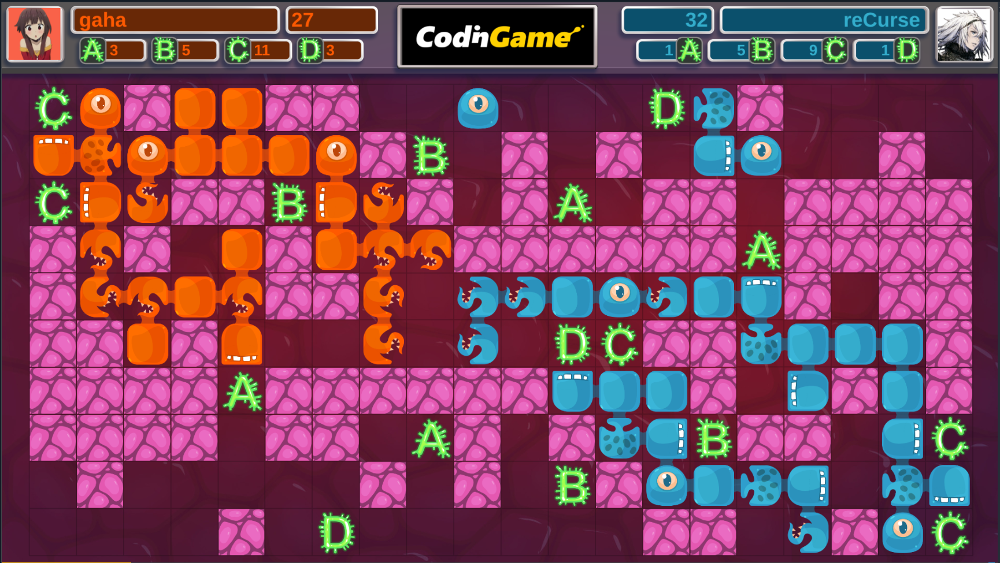
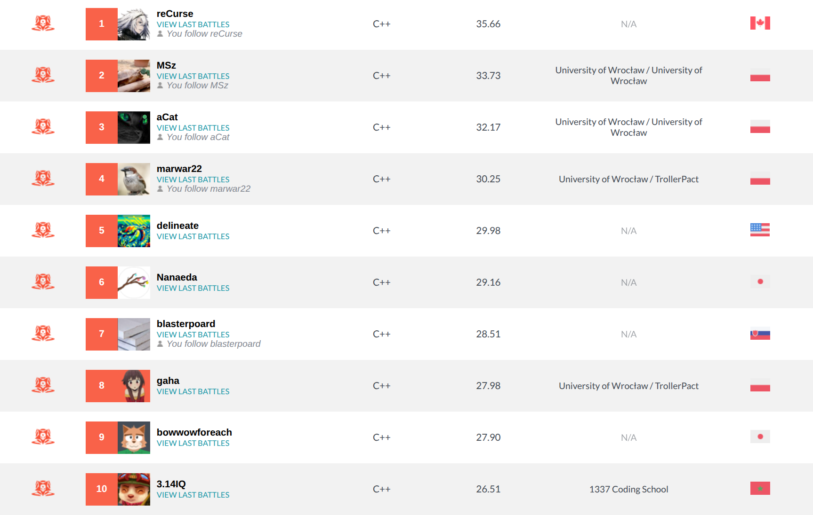

# Cellularena

[CodinGame Leaderboard Link](https://www.codingame.com/contests/winter-challenge-2024/leaderboard/global)

Final Position: **#8**

## Approach

I was doing a beam search with eval function based on distances to proteins, current income and voronoi territory. Distances computation is expensive, so this is a shallow search - in the most complex situations just the current turn; but I allow searching up to 7 turns deep (most of the time ~2 turns). I fought a lot with RPS in my local leaderboard: in my search, I am assuming a specific set of greedy actions for my enemy and the RPS effect depends on what moves exactly I assume for the enemy. For example, a version that assumes a greedy move for the enemy loses ~70% with the version that does one more level of "enemy move assumptions" while not being better with other bots. I don't see a clear and efficient way to break out of the RPS and I am hoping to learn how others dealt with that. 

## Leaderboard

