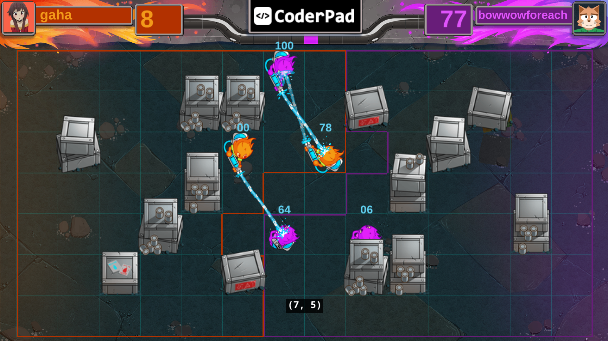
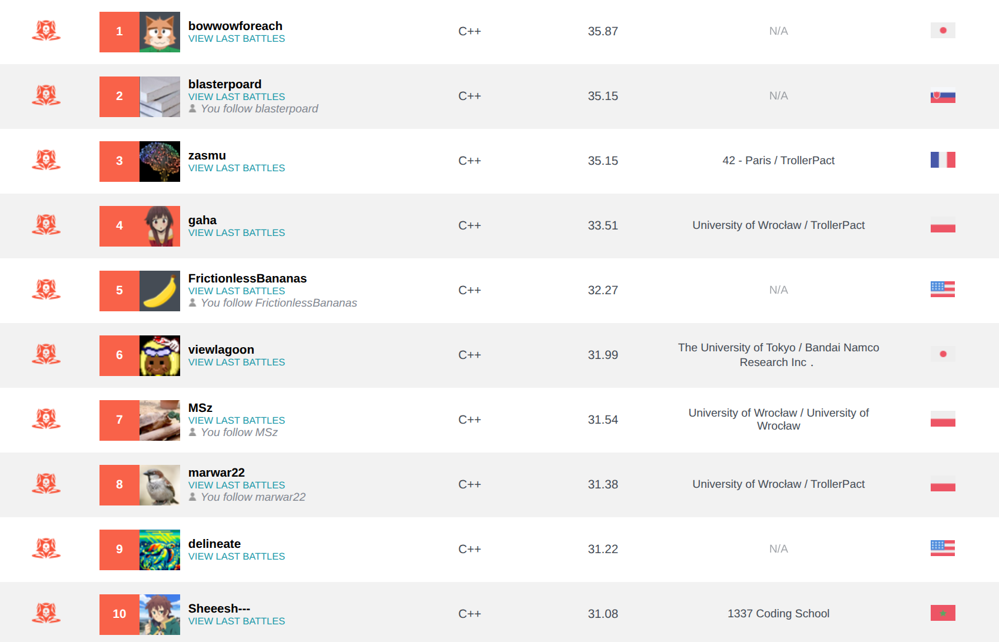

# Soak Overflow

[CodinGame Leaderboard Link](https://www.codingame.com/contests/summer-challenge-2025-coderpad-play/leaderboard/global)

Final Position: **#4** (out of 3827)

## Approach

My solution is similar to that for Cellularena (Winter Challenge 2024). There are two parts to it and they are mostly independent, which made it convenient to experiment, as I was able to replace a single part of my solution without touching the other.

### Selecting action-sets for a single game turn

This part of my solution focuses on selecting the K (between 4-24) most promising action-sets (combinations of actions for all agents under my control) for just a single game turn. I ended up using a simple, non-adversarial GA that evaluates the state after applying all the actions. The search phenotype consists of up to 5 actions (each action includes both movement + combat) and is initialized randomly. Mutation operator replaces a single action with a new one, also selected randomly. For my opponent I also run (a lower effort) GA to determine and freeze a limited number (up to 5) of their possible action-sets and I select the most pessimistic of them in “max min” fashion.

### Deep search over the action-sets

This is an outer search that internally launches the inner search (described above) for every game state it encounters to limit the number of possible action-sets. As for the specific search algorithm, I am using a beam search with depth up to 8 full game turns (but it usually finishes early between depth 4-6). Beam width varies on different depths, but it lands up somewhere between 20-30.

### Heuristic score function and performance

I used the same heuristic score function to evaluate states in both parts of my solution. The function ended up pretty basic - it includes territory, agents’ health, bombs and distances from the opponent’s agents. I tried adding more components to it, but it didn’t seem to help.

I invested a significant amount of time optimizing the performance of my solution. I am utilizing AVX instructions to speed-up the territory computation. In the end, during a 50ms turn, I am simulating and evaluating between 100k-170k game states (depending on the specific VM and seed).

As usually, I truly enjoyed this competition and I am looking forward to the next one. Congratulations to the winner: @bowwowforeach and the runner-ups: @blasterpoard and @zasmu.

## Q&A

> If i understand correctly, every beam iteration run the GA? How many iteration the GA uses to find a good combination of actions?

Yes, I am running GA in every iteration of BS. You can think of the GA as part of “get_legal_moves” function in BS pseudo-code. The number of iterations is tuned (manually) depending on the depth, but for my actions it is somewhere between 20-400 iterations and for the opponent it was between 5-40.

## Leaderboard

