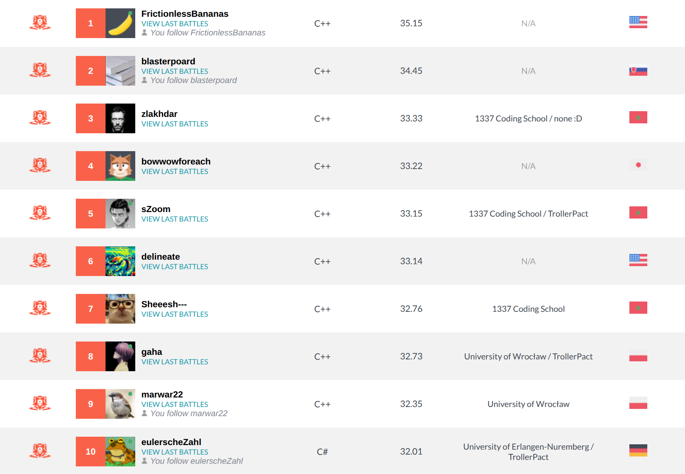

# SnakeByte

[CodinGame Leaderboard Link](https://www.codingame.com/contests/winter-challenge-2026-exotec/leaderboard/global)

Final Position: **#8** (out of 2382)

## Approach

Until last night, I was using a single beam search with width 90 and depth typically between 6-15. It considered all
legal move combinations for my snakes (pruning only immediate collisions), and for the opponent it assumed greedy
decisions snake-by-snake. The score function uses many small features, with simple raw BFS distance at the center. I
tried optimizing the specific parameters with Optuna and I think it helped a bit.

Speed was decent for me, reaching about 30-40k sims per 30ms in worst cases, but most of that time is spent at scoring.
The engine itself could run at least 100k sims per turn in worst cases and usually 150-200k on legend maps. I use one
simplification: the engine tracks only 64 apples at a time, even if more exist, so I need to select the closest apples
every turn (which also requires reordering the precomputed BFS table).

Last night, I implemented something extra that resulted in local 5-7% WR bump. I was debugging it for most of the night
before it finally started to work. I added one extra beam search per snake before starting the main search. There I
optimize a solo-player variant of the game. Each snake tries to collect as many apples as possible, using the real game
rules, but ignoring other snakes entirely. I use a much simpler score function than in the main beam. I run it with
width 300 and depth 16 for every snake and it takes 2-5ms every turn. It is fast, and because State contains only a
single snake and apples bitmask, hash-based deduplication works well.

Now, the two searches must stay in sync. In the main search, each State additionaly holds 8 pointers to the solo
states (one per snake) and updates them accordingly after every move. I think I could squeeze more %WR from this feature
if I had more time to tune it. A PVP-oriented addition would likely help even more, but I did not have strong ideas
beyond adding a shallow minimax, which I did not attempt.

## Leaderboard

