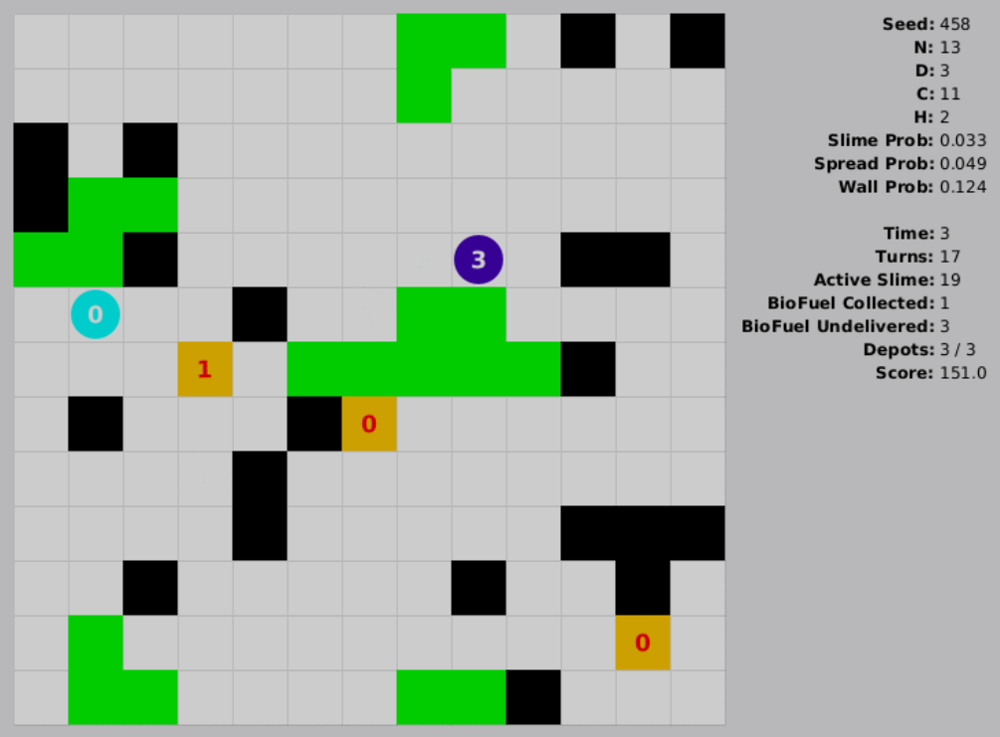
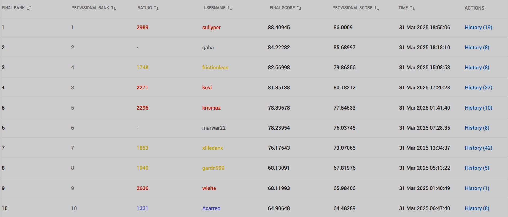

# BioSlime

[TopCoder Challenge Page](https://www.topcoder.com/challenges/80d19de8-91f2-47fa-b08d-af71e4ca2fbb)

Final Position: **#2** 

## Approach

I run a beam search, separate for each harvester. I assume new slimes won't spawn. I hardcode width to 32 and depth between [8, 16] depending on H. I implemented sanity checks to speed things up if I am going overtime but - according to my testing - it should not happen. Before starting the search, harvesters get their special targets assigned. Special targets are: slimes very close to depots or slimes that are blocking other harvesters' return routes. Those targets are used in my score function. The main part of my score function is the gathered slime divided by the distance to the closest depot. After selecting the best moves according to the BS, I repeat the BS once again, but now all moves are known, so i-th harvester knows how all other harvesters moved.

Also, every turn (to determine the order) I sort harvesters by either:
- score from depth-1 search
- the amount of slime they are carrying.

More info about the scoring function:
- I keep track of how many "growth fields" there are on map and I try to maximize this value in my score function.
- I have 3 slightly different variants of the score fn depending on N and H
- I have some emergency checks, if - for example - there are less than 4 slimes on the map small impulse to stay close to the closest depo also a small impulse not to stay right next to other harvesters

That's the main idea!

## Leaderboard

