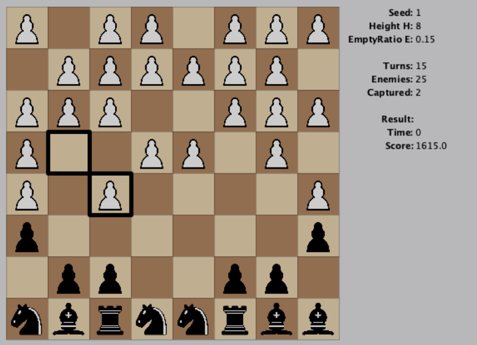

# HordeChess

[TopCoder Challenge Page](https://www.topcoder.com/challenges/9e87736a-3977-499e-a963-70466b81c948)

Final Position: **#4** 

## Approach

I run Expectimax ([wikipedia link](https://en.wikipedia.org/wiki/Expectiminimax#Expectimax_search)):

* In every turn, I run the search to depth between 3 and 2 full moves (6 and 4 halfmoves)

* I set a time limit for each turn as `TIME_REMAINING / PAWNS_REMAINING`. I run search on depth 2 to sort the moves. Then I run each move on depth 3 until I exceed time limit for the turn. If I am over 9000ms then I only run the depth 2 search to stay under 10s time limit.

* One thing that helped me a lot to do more depth-3 searches is: when there are over 32 possible actions, I sort them according to action heuristic and I only check the top 32.

