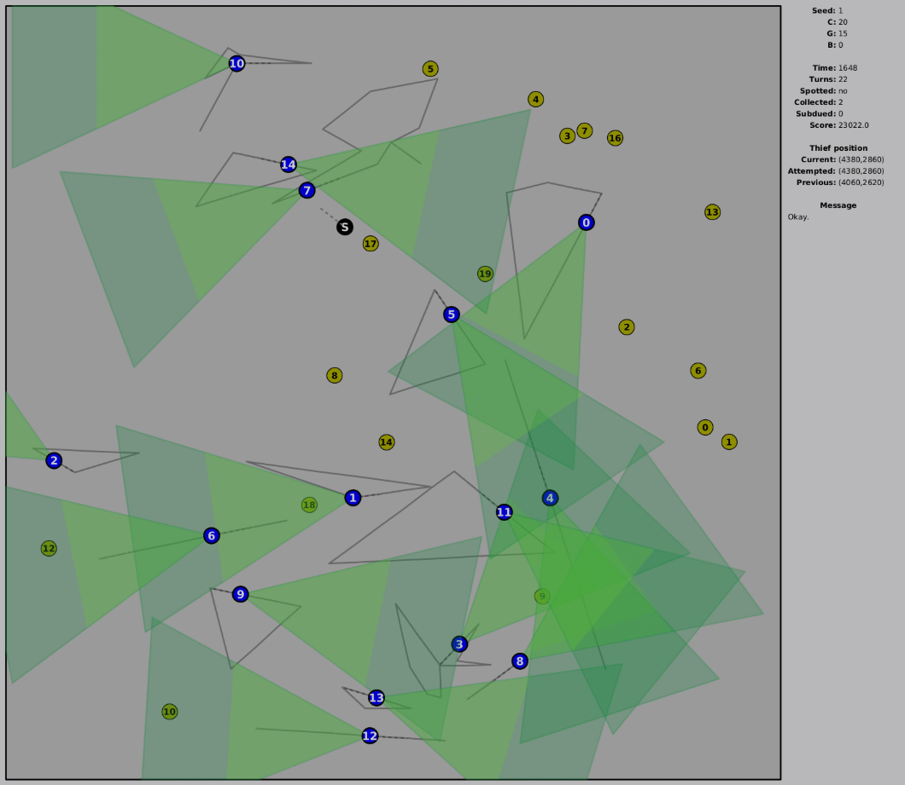

# DaylightRobbery

[TopCoder Challenge Page](https://www.topcoder.com/challenges/883d6bcd-3749-427a-964a-ac8435737228)

Final Position: **#5** 



## Approach

I will describe two components separately.

**Inner search**

I have an A*-like search that finds me a shortest route to a coin or to a guard. It operates on a 40x40 grid. I spent most of my dev time optimizing this. It is probably the most optimized piece of code I ever produced. 

My legal moves in this search are limted to a 40x40 cells (which translates to 250x250 grid):
```
{-400, 0}, {-360, -160}, {-360, 160}, ...
```

**Outer search**

Then I have a Chokudai search that orchestrates the solution. Each iteration runs up to 150 actions deep (100 coins + 50 guards). Possible actions are:
- picking one of the 4 closest coins (up to depth 30)
- bribing one of the 4 closest guards (up to depth 20)

This search runs until the time runs out. To sort the states, I use the real score + a heuristic that tries to predict future score from the remaining coins. Overall, I don't like this "outer" part of my solution. Definitely didn't spend enough time on it. 

I am getting (locally):
- 5 Chokudai iterations per second on seed 2
- 3.2kk A*-like iterations per second on seed 2
