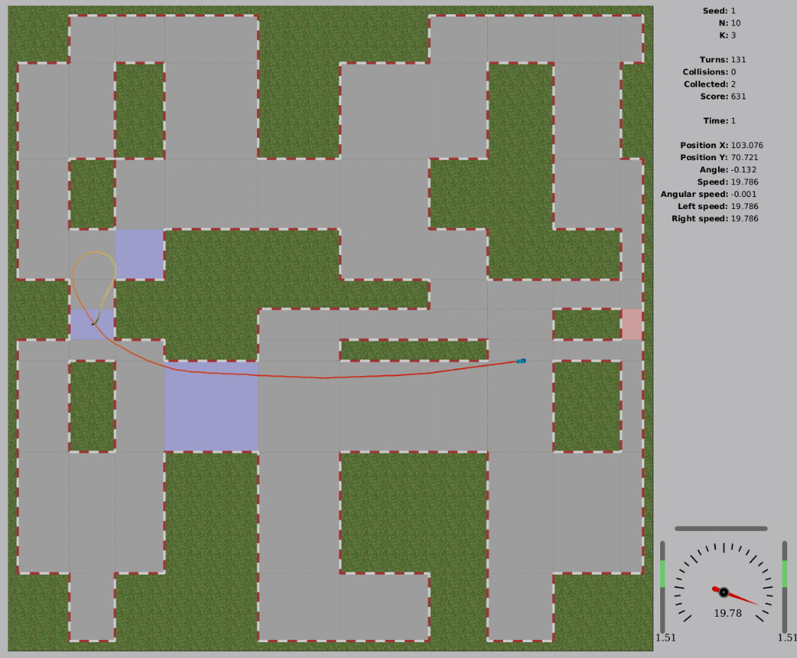

# RacingCar

[TopCoder Challenge Page](https://www.topcoder.com/challenges/d6afa51e-e32b-4776-90ce-218cf65031d4)

Final Position: **#???** 

## Approach

I ran a **beam search** variant multiple times to evaluate multiple TSP checkpoint orderings found using **simulated annealing**.

**Precomputation**

Before starting the simulation and search, I need to do a significant amount of precomputation, which can often take more than 1 second out of the 10-second time budget. In this stage, I need to identify all convex corners of "grass islands" on the map. I specifically look for them, because I determined that all shortest paths must pass through those (or lead directly from source to target, if it is reachable without crossing grass).

Next, I run Dijkstra's algorithm to find the shortest paths between all checkpoint centers and every cell center. There are at most 20x900 of them. Notice that the checkpoints are included among the cells - so at this stage I also save a 20x20 matrix of distances between checkpoints. I am also storing the distances to grass convex corners.

Summing up, I need to store the following data for future computation:

- 20x20 distances between the checkpoints
- 20x900 paths between checkpoint centers and all cell centers
- 20x900 distances between checkpoint centers and grass corners

One trick I apply at this step, to gain a subtle improvement later, is to modify the Dijkstra edge distances with a penalty that depends on the angle between two consecutive edges in the path. This way, I simulate my preference for paths that avoid sharp turns. If I ever find two paths with similar lengths, but one of them having significantly sharper turns, my Dijkstra prefers the straighter one.

**Solving TSP**

At this stage, I want to solve a TSP-like problem. I am looking for a Hamiltonian path (not cycle) that visits all checkpoints from the starting point. Here, I am not interested in finding the specific route, but only the best possible checkpoint order.

This part is cheap computation-wise, because there are only up to 20 nodes in the graph, and the result doesn't even need to be very accurate. In fact, I am fine if the algorithm returns a suboptimal solution. Because of the driving dynamics, the shortest path found in the TSP won't necessarily be the fastest one for my car to drive. So, even if I spend a lot of time optimizing the TSP, it will not guarantee us the optimal path for the car.

To solve the TSP, I am running a simple Simulated Annealing search with a 2-opt mutation operator for 10'000 steps with linear temperature decay to produce a single TSP checkpoint ordering. This search is very quick, taking a few milliseconds or less. Having a checkpoint ordering on hand, I can continue to the next step. 

**Solving Driving**

That's the main part of the solution. At this stage, I have finished all the precomputation and computed a TSP checkpoint ordering.

Let me start by describing the heuristic score function used to identify the best states. The function is very simple and needs only two factors: the number of checkpoints already visited (in the right order!) and the distance to the next checkpoint in order. The distance to the next checkpoint might seem tricky and I don't know how to compute it exactly, so I use an approximation. Let's say I am evaluating a state where the car is currently at position (x, y) and in the (row, col) cell in the grid. Using the previously precomputed data, I check the shortest route from (row, col) to (target_row, target_col). From the route, I can extract the specific convex grass corner to visit next. The total approximated distance to the checkpoint is simply the sum of the Euclidean distance to the corner and the precomputed distance from the corner to the goal.

There's only one unusual thing about this beam search, so I will focus on that now. A beam search guided only by distance to the next checkpoint can be easily fooled to think it is best to drive as fast as possible. To encourage slowing down and initiating turns left/right even though those don't seem beneficial yet, I enforce diversity by introducing disjoint buckets for beam states. Specifically, at each depth, I maintain 1540 buckets, and every bucket holds between 18 and 64 states for an effective beam width of 27'720 to 98'560. When inserting a new state into the beam, I first compute its bucket index based on its velocity and angular velocity, and then perform a standard min-heap insert. This beam design allows the candidate states to proactively slow down and take turns instead of crashing.

Other info:

- To minimize the search space, I consider only 4 possible actions, which correspond to maximum forward/backward acceleration and maximum left/right turns.

- To be able to recreate the move sequence found by beam search, I need to store all depths in memory. This requires a significant amount of memory and consumes nearly all of the 1024 MB available.

**There's more...**

At this stage, with precomputation, checkpoint ordering, and beam search complete, I am ready to return a solution. However, having optimized the score function, those steps usually take much less than 10 seconds. I will repeat the computation with modified TSP checkpoint ordering multiple times until I run out of the allotted time. To modify the checkpoint ordering, I tweak the 20x20 distance matrix randomly and rerun the TSP solver. If the new checkpoint ordering is different from the old one, I rerun the beam search as well. At this stage, there are subtle tricks to avoid redundant recomputation by skipping depths that I can guarantee to be identical between the old and the new beams, but I won't dwell on that.

For the simulation, I copied code from the tester and translated it to C++. I re-implemented the grid movement mechanics by myself, but that wasn't a performance bottleneck and didn't result in a measurable improvement. As in the tester, I continued using double precision, though switching to floats might have been better from a performance standpoint.

**Beam visualization**

In the GIF, you can see the beam search in action.

